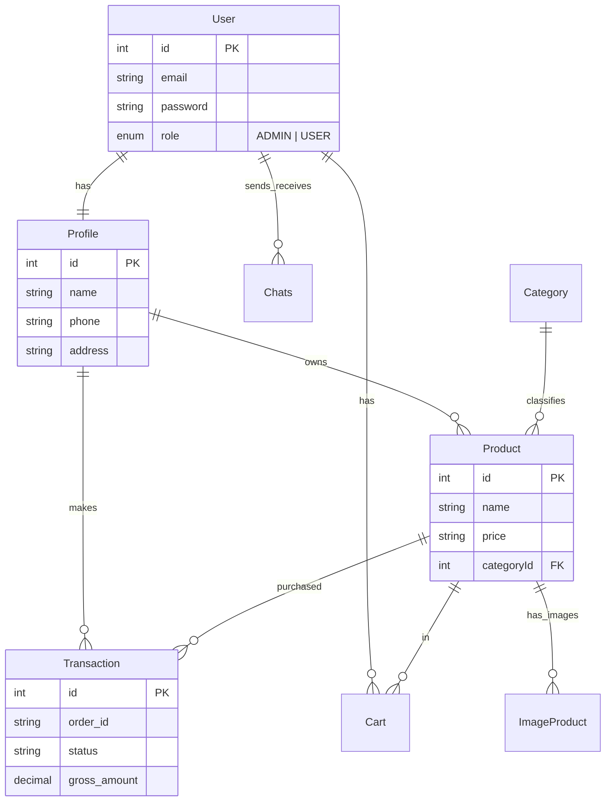

# 🗄️ Database Schema

The database uses **PostgreSQL** and is managed by **Prisma ORM**.

## 🧩 E-R Diagram (Mermaid)

## 📋 Models Design

### User
System users.
- `role`: Determines access level. `ADMIN` can manage products.

### Profile
Extended user information separate from authentication credentials.
- Contains PII like `phone`, `address`.

### Product
Items available for sale.
- Linked to `Category`.
- `quantity`: Tracks inventory (stored as String in schema, consider migrating to Int).

### Transaction
Records of purchases.
- `status_code`, `transaction_status`: Mapped from Midtrans response.
- `gross_amount`: Decimal precision for financial accuracy.

### Chats
Stores message history between users.
- `roomId`: Unique identifier for the conversation pair.
